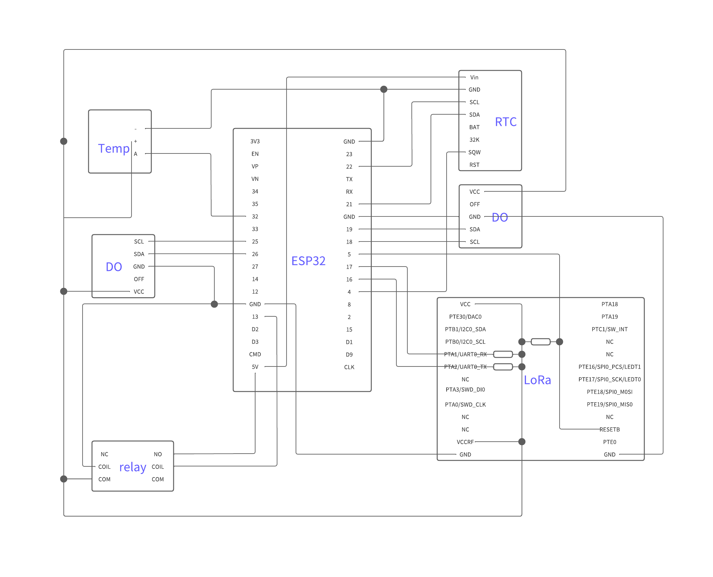

Here are all the esp32 code you need to use LoRa module, DO sensor, temp sensor, RTC, and relay.

## prep

Please see through these references if this is your first time using LoRa module (ES920LR)

- [【Private LoRa】ESP-WROOM-32をホストマイコンにしてES920LRの設定をする](https://zenn.dev/masaoguchi/articles/4f56abc05bae83)
(This article was very helpful, but espsoftwareserial doesn't work well with the default baudrate of 115200, so I changed the baudrate with USB to TTL converter like [this](https://store.roboticsbd.com/components/389-pl2303-usb-to-ttl-converter-robotics-bangladesh.html) first with `screen` command on Mac)

Here are the official manual for ES920LR
- [command manual](https://easel5.com/documents/files/ES920LR%E3%82%B3%E3%83%9E%E3%83%B3%E3%83%89%E4%BB%95%E6%A7%98%E3%82%BD%E3%83%95%E3%83%88%E3%82%A6%E3%82%A7%E3%82%A2%E8%AA%AC%E6%98%8E%E6%9B%B8_v121.pdf)
- [data sheet](https://easel5.com/documents/files/ES920LR%E3%83%87%E3%83%BC%E3%82%BF%E3%82%B7%E3%83%BC%E3%83%88_1.06-1.pdf)

## hardware

### esp32
[this esp32](https://akizukidenshi.com/catalog/g/gM-11819/) is being used for the reason explained in the above article (relating to the operating voltage)
but using esp32 have various problems
- inaccrate reading of analogRead()
    - explained in [this article](https://www.upesy.com/blogs/tutorials/measure-voltage-on-esp32-with-adc-with-arduino-code)
    - this got better with the method explained in [this article](https://kohacraft.com/archives/202202091047.html), but it still have about 7mV error and can only measure up to about 1.9V
- high energy consumption
    - esp32 have bluetooth module and Wi-Fi module that we don't need
    - deepsleep mode of esp32 still consume about 0.0664W (5.0242V,0.0132A)

This needs to be improved by swapping to another arduino and using logic level converter

### DO sensor
[this DO sensor](https://atlas-scientific.com/kits/dissolved-oxygen-kit/) is being used.
data sheets and sample codes are in the website

**To use my code, you need to disable continuous reading and OK response**
you can do this with `DO-uart_interactive.ino`

here are some tips
- calibration to the air
    - you need to do this outside or near an open window
- inside testing
    - this sensor needs water flow because sensoring consumes oxygen
- temperature compensation
    - don't forget to do this as this makes a huge difference in reading value

### temp sensor
[this temp sensor](https://atlas-scientific.com/kits/gravity-rtd-analog-kit/) is being used.
data sheets and sample codes are in the website

you can just analogRead the value to get temp, no need to calibrate (no way to calibrate)
but be careful with the analogRead accuracy

### RTC
[this RTC](https://www.adafruit.com/product/3013) is being used.
data sheets and sample codes are in the website

to wakeup esp32, RTC needs to have alarm function and that is why this RTC is being used
if you don't need to wakeup, [this RTC](https://www.adafruit.com/product/3296) is cheaper

### relay
[this relay](https://akizukidenshi.com/catalog/g/gP-01347/) is being used.
data sheets are in the website

I tried [this mosfet](https://akizukidenshi.com/catalog/g/gI-07597/) and [this relay](https://akizukidenshi.com/catalog/g/gP-07651/), but they didn't work well probably because of inadequate output current from the esp32 pin

### wiring diagram

## code

- baudrate_setting
    - code for just setting up ES920LR
    - not recommended to change baudrate with this
- communication
    - implimentation of communication methods
    - request method and timeslot method
    - file name indicates which feature that file has
- DO_uart
    - send command to DO sensor in script
- DO_uart_interactive
    - send command to DO sensor in serial monitor
- just_send
    - just send message with ES920LR
- rtc_test
    - example of RTClib
- wakeup_rtc
    - example of esp32 sleep and waking up with RTC